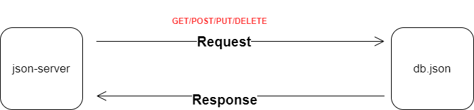

# api-server

### Author: Fatima Atieh


## Swagger Documentation

[Swagger documentation that was created at Swagger Hub](https://app.swaggerhub.com/apis/fati-ma/api-server/0.1#/)


## Setup

- Install JSON Server
```
npm i -g json-server
```

- Start JSON Server
```
json-server --watch ./data/db.json
```


## Test

- GET ALL: GET - http://localhost:3000/categories
- GET SOME: GET - http://localhost:3000/categories?category=cars
- GET ONE: GET - http://localhost:3000/categories/1
- UPDATE ONE: PATCH or PUT - http://localhost:3000/categories/1
- DELETE ONE: DELETE - http://localhost:3000/categories/1


## UML

