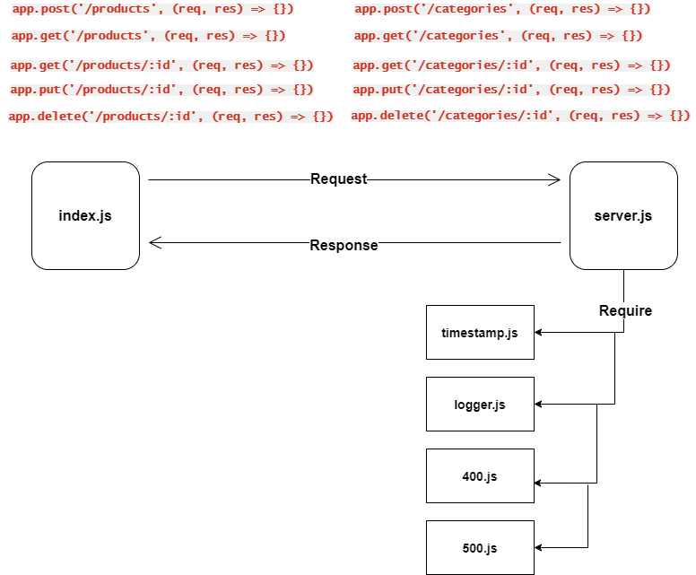

# Api Server

### Author: Fatima Atieh

## Swagger Documentation

[Swagger documentation](https://app.swaggerhub.com/apis/fati-ma/api-server/0.1#/) that was created at Swagger Hub

## Setup

`npm init -y`

`npm i express dotenv jest supertest mogoose @code-fellows/supergoose  morgan cors`

Add `PORT` in `.env`

Add `MONGODB_URI` in `.env`

start mongodb `sudo service mongod start`

start the server:
  - `node index.js`
  - `nodemon`
  - `npm start`

## Endpoints

    - http://localhost:3000/api/v1/products  
    - http://localhost:3000/api/v1/products/1

    - http://localhost:3000/api/v1/categories
    - http://localhost:3000/api/v1/categories/1

## Test

  - Manual
    - GET ALL: GET - http://localhost:3000/api/v1/products
    - GET ONE: GET - http://localhost:3000/api/v1/products/1
    - UPDATE ONE: PUT - http://localhost:3000/api/v1/products/1
    - DELETE ONE: DELETE - http://localhost:3000/api/v1/products/1
    - GET ALL: GET - http://localhost:3000/api/v1/categories
    - GET ONE: GET - http://localhost:3000/api/v1/categories/1
    - UPDATE ONE: PUT - http://localhost:3000/api/v1/categories/1
    - DELETE ONE: DELETE - http://localhost:3000/api/v1/categories/1

  - jest
    - `npm test`

## UML     

